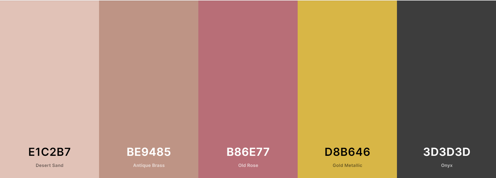

# ARTstop
ARTstop is an online shop that allows users to purchase a variety of art works from different artists. It also promotes artists and lets registered users take online classes to improve their own artistic skills. 

You can find the live site [here](https://ms4-artstop.herokuapp.com/)

---
---
# Contents
+ [User Experience](#user-experience)
  + [User Stories](#user-stories)
  + [Design](#design)
    + [Overall Feel](#overall-feel)
    + [Colour Scheme](#colour-scheme)
    + [Typography](#typography)
    + [Imagery](#imagery)
  + [Wireframes and Initial Design](#wireframes-and-initial-design)
    + [Wireframes](#wireframes)
    + [Design Mock Up](#design-mock-up)
+ [Features](#features)
  + [Current Features](#current-features)
  + [Possible Future Features](#possible-future-features)
+ [Database](#database)
+ [Technologies Used](#technologies-used)
  + [Languages](#languages)
  + [Frameworks and Libraries](#frameworks-and-libraries)
  + [All Others](#all-others)
+ [Testing](#testing)
+ [Deployment](#deployment)
  + [Deployment through GitHub Pages](#deployment-through-gitHub-pages)
  + [Forking the Repository](#forking-the-repository)
  + [Cloning Project](#cloning-project)
+ [Credits](#credits)
  + [Content](#content)
  + [Media](#media)
  + [Acknowledgements](#acknowledgements)
---
---
# User Experience
## User Stories

### As an unregistered, I want to :

+ be able to browse through all products available.
+ have the ability browse through the artists promoted on the site.
+ have the ability to contact the artists promoted on the site.
+ have the ability browse through the classes available on the site.
+ have generic questions answered without having to contact the store owner/admin.
+ be able to view my bag and any items I currently have awaiting payment in my bag.
+ be able to add, edit quantity and remove items from my bag.
+ be able to purchase from the site without having to register for an account.
+ have the ability to register to the site if I choose to.

### As a registered user, I want to:

+ have the ability to log in to the site with  my details.
+ have a record of any purchases that I have made in the past and view them in detail.
+ be able to update my shipping information.
+ be able to update my shipping information from the checkout page. 
+ be able to view the class videos offered.

### As the site administrator, I want to:

+ be able to log in to an admin panel.
+ be able to add, update or remove products, artists and classes without vistiting the admin panel.
+ receive email notifications when a user submits through the contact page.

## Design
### Overall Feel

For this site I wanted a very white, modern feel that would emulate a gallery experience. Generally speaking, galleries have stark white walls that offer no distraction from the work exhibited and that is the experience that I wanted to capture. 

### Colour Scheme

While white is the main colour for the site and will be itilized as much as possible, I chose accent colours that I thought would not be overwhelming and add an elegance to it. 

The colours are muted and quite neutral so as to not overwhelm the user. 
The gold adds a touch of decadance.
The dark grey will be used for the majority of the text.

### Typography
I chose the [Abel](https://fonts.google.com/specimen/Abel) font for the text throughout the site. I like the simplicity of a san serif font but Able has a little bit of personality. 

### Imagery

The imagery throughout the site will be primarily dictated by the products for sale.

However, to add to the modern feel, the background image consists of line art hexagons in a muted colour. This will break the white up slightly without distracting from the work on sale. 

The home page uses shapes in the accent colours and a few selected works to give the illusion of images hanging in a group on a wall - something that a customer could do if they had a few pieces to display.

## Wireframes and Initial Design

### Wireframes
All Wireframes were designed for laptop/computer, iPad/tablet and phone display.
+ All wireframes [here](#)

### Design Mock Up
+ All designs [here](#)

---
---
# Features
## Current Features

## Possible Future Features

---
---

# Database

---
---
# Technologies Used
## Languages

## Frameworks and Libraries

## All Others

---
---
# Testing
Due to the size of the testing section, I have created a separate document for it. You can find it [here](https://github.com/AmyOShea/MS4-ARTstop/blob/master/TESTING.md). 

---
---
# Deployment

## Heroku Deployment

### Requirements and Procfile

### Environmentals File

### Creating Heroku App

### Connecting to GitHub

## Forking the Repository

## Making a Local Clone

---
---
# Credits
## Code

## Content

### Media

Due to the size of the media credits section, I have created a separate document for it. You can find it [here](https://github.com/AmyOShea/MS4-ARTstop/blob/master/MEDIA-CREDITS.md). 

## Acknowledgements
