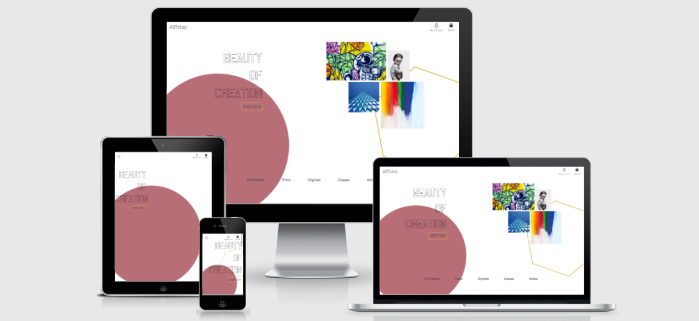
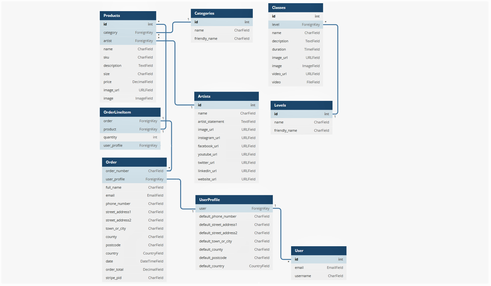

# ARTstop
ARTstop is an online shop that allows users to purchase a variety of art works from different artists. It also promotes artists and lets registered users take online classes to improve their own artistic skills. 

You can find the live site [here](https://ms4-artstop.herokuapp.com/)



---
---
# Contents
+ [User Experience](#user-experience)
  + [User Stories](#user-stories)
  + [Design](#design)
    + [Overall Feel](#overall-feel)
    + [Colour Scheme](#colour-scheme)
    + [Typography](#typography)
    + [Imagery](#imagery)
  + [Wireframes and Initial Design](#wireframes-and-initial-design)
    + [Wireframes](#wireframes)
    + [Design Mock Up](#design-mock-up)
+ [Features](#features)
  + [Current Features](#current-features)
  + [Possible Future Features](#possible-future-features)
  + [Defensive Design Features](#defensive-design-features)
+ [Database](#database)
+ [Technologies Used](#technologies-used)
  + [Languages](#languages)
  + [Frameworks and Libraries](#frameworks-and-libraries)
  + [All Others](#all-others)
+ [Testing](#testing)
+ [Deployment](#deployment)
  + [Heroku Deployment](#heroku-deployment)
  + [Set up AWS](#set-up-aws)
  + [Set up Emails](#set-up-emails)
  + [Forking the Repository](#forking-the-repository)
  + [Making a Local Clone](#making-a-local-clone)
+ [Credits](#credits)
  + [Content](#content)
  + [Media](#media)
  + [Acknowledgements](#acknowledgements)
---
---
# User Experience
## User Stories

### As an unregistered, I want to :

+ be able to browse through all products available.
+ have the ability browse through the artists promoted on the site.
+ have the ability to contact the artists promoted on the site.
+ have the ability browse through the classes available on the site.
+ have generic questions answered without having to contact the store owner/admin.
+ be able to view my bag and any items I currently have awaiting payment in my bag.
+ be able to add, edit quantity and remove items from my bag.
+ be able to purchase from the site without having to register for an account.
+ have the ability to register to the site if I choose to.

### As a registered user, I want to:

+ have the ability to log in to the site with  my details.
+ have a record of any purchases that I have made in the past and view them in detail.
+ be able to update my shipping information.
+ be able to update my shipping information from the checkout page. 
+ be able to view the class videos offered.

### As the site administrator, I want to:

+ be able to log in to an admin panel.
+ be able to add, update or remove products, artists and classes without vistiting the admin panel.
+ receive email notifications when a user submits through the contact page.


## Design
### Overall Feel

For this site I wanted a very white, modern feel that would emulate a gallery experience. Generally speaking, galleries have stark white walls that offer no distraction from the work exhibited and that is the experience that I wanted to capture. 

### Colour Scheme

While white is the main colour for the site and will be itilized as much as possible, I chose accent colours that I thought would not be overwhelming and add an elegance to it. 


The colours are muted and quite neutral so as to not overwhelm the user. 
The gold adds a touch of decadance.
The dark grey will be used for the majority of the text.

### Typography
I chose the [Abel](https://fonts.google.com/specimen/Abel) font for the text throughout the site. I like the simplicity of a san serif font but Able has a little bit of personality. 

I chose the [Milstone Outline](https://www.dafont.com/milestone-outline.font) font for the hero section of the home page. I thought it was an interesting font that added a little bit of flair to the site. 

I chose the [Yaldevi](https://fonts.google.com/specimen/Yaldevi?query=Yaldevi) font for the logo text in the header. I think it works well with the Able font.

### Imagery

The imagery throughout the site will be primarily dictated by the products for sale.

However, to add to the modern feel, the background image consists of line art hexagons in a muted colour. This will break the white up slightly without distracting from the work on sale. 

The home page uses shapes in the accent colours and a few selected works to give the illusion of images hanging in a group on a wall - something that a customer could do if they had a few pieces to display.


## Wireframes and Initial Design

[Initial wireframes here](docs/MS4-wireframes.pdf)

All Wireframes were designed for laptop/computer, iPad/tablet and phone display:

[Initial design idea here](docs/MS4-design.pdf)

As the project progressed, some element placement was tweaked and updated. However, I think that the layout changes were not so drastic that they warrented new wireframes to be designed. 

---
---

# Features
## Current Features
### **Navigation menu displayed across all pages**

The navigation menu will help the user move easily across all pages.

The navigation buttons update depending on whether a user is logged in or not, and whether that user is the admin:

| Nav Link              |Not logged in  |Logged in as user|Logged in as admin
|:-------------         |:------------- |:----------------|:------------- |
|Logo(back to home)     |&#9989;        |&#9989;          |&#9989;
|Product Management     |&#10060;       |&#10060;         |&#9989;
|Artist Management      |&#10060;       |&#10060;         |&#9989;
|Class Management       |&#10060;       |&#10060;         |&#9989;
|My Profile             |&#10060;       |&#9989;          |&#9989;
|Sign Out               |&#10060;       |&#9989;          |&#9989;
|Register               |&#9989;        |&#10060;         |&#10060;
|Sign In                |&#9989;        |&#10060;         |&#10060;
|All Products           |&#9989;        |&#9989;          |&#9989;
|Prints                 |&#9989;        |&#9989;          |&#9989;
|Originals              |&#9989;        |&#9989;          |&#9989;
|Classes                |&#9989;        |&#9989;          |&#9989;
|Artists                |&#9989;        |&#9989;          |&#9989;

### **User registration not required**

It was important that the user was given the option to purchase from the store without having to register for an account. It's a personal pet peeve of mine to have to make accounts on online stores when I'm not guaranteed to go back again and art isn't necessarily a regular purchase. 

Even if a user doesn't have an account, they are still able to purchase, input a delivery address and have a confirmation email sent to them when they have completed a purchase. 

### **User profile creation**

A user has an option to create an account if they want to. 
Registration process:

+ Username
   + A user can choose a username as long as it hasn't already been taken
   + The user will receive an error notification immediately if their username has already been taken

+ Email address
   + A user needs to sign up using an email address
   + The email has to be inputted twice to avoid typo issues
   + This triggers an automatic email to be sent to the user to confirm the email address as correct and set up the account. 

+ Password
   + The password has to be inputted twice to avoid typo issues

With a user profile: 
+ the user has access to the class videos. 
+ order history is saved & displayed in their profile.
+ Save default delivery information to their profile from the checkout page.
+ Update default delivery information to their profile from their profile page.

---

### **Products Page**

All users can browse through the available products.
Products can be sorted by:
+ Price
+ Name
+ Artist

All products fall into either **originals** or **prints** and are then filtered by their categories:

+ Originals:
   + Watercolour Paintings
   + Acrylic Paintings
   + Oil Paintings
   + Mixed Media

+ Prints:
   + Photographs
   + Art Prints
   + Digital Art

If a user wants to know more about a product, they can click it and open the product detail page.

---

### **Product Details Page**

From the product detail page, the user can view:
+ Product name
+ Product artist
+ Product category
+ Product price 
+ Product description 

The user can can then either go back to the products page, add a single item to ther bag or adjust the quantity to add to the bag

---

### **Artists Page**

All users can browse through the artists. If a user wants to know more about a artist, they can click it and open the artist detail page.

---

### **Artist Details Page**

From the product detail page, the user can view:
+ Artist name
+ Artist statement
+ Artist's external contact links

At the bottom of the artist detail page the user can view images of the work that the particular artist has for sale on the site. The user can click on any of the images an be directed to that product's detail page.

---

### **Classes Page**

All users can browse through the classes available. The classes categories are **beginner**, **intermediate*** and **advanced** and can be filtered as such. If a user wants to know more about a class, they can click it and open the class detail page.

---

### **Class Details Page**

From the product detail page, the user can view:
+ Class name
+ Class level
+ Class duration
+ Class descripton

If the user is logged in, they will be able to access the video file and play it. 

If the user is not logged in, they will be asked to either sign in or register for an account - links to both options are provided.

---

### **Admin CRUD functionality**

As well as all of the abpve features(read), the admin can add, edit and delete products, artists and classes from the site - they don't have to visit the admin panel for this. 
+ Add(*Create*): 
From the 'My Account' dropdown, the admin can choose 'Product Management', 'Artists Management' or 'Class Management'. This allows them to create the item by filling in the form.

+ Edit(*Update*): 
From the item detail page, the admin has an edit button that will direct them to the edit page. All of the form fields wil be populated with the item information that can then be updated and saved. 

+ Delete(*Delete*)
From the item detail page, the admin has a delete button that will trigger a confirmation modal. Once the admin confirms deletion, the item will be removed from the database

---

### **Bag**

A user can open the bag page at any point and see what items thay have in there. 

From here a user can update product quantities, remove items from the bag or access the checkout page. 

---

### **Checkout**

The checkout page allows the user to:
+ use their default delivery address(if they have an account, are logged in and have saved those details)
+ input new delivery information if needed or are checking out as a guest
+ update their profile with the inputted edlivery information(if they have an account and are logged in)
+ Pay via Stripe for secure payments
+ A loading screen will appear when a payment is being processed to stop the user clicking away
+ If the payment form doesn't submit properly or the user closes the browser during the wait animation, Stripe will still create the order for the user. 
+ An email wil be sent to the user with their order confirmation

---

### **Contact page**

The user can fill out a contact form and send a message to the site admin. This will send an email directly to the admin's email rather than to the admin console. 

---

### **FAQ's page**

The user can browse through the FAQ's page and have generic questions answered rather than have to contact the site admin.

---

### **Emails**

The site will send real emails when needed:

+ New customer registration
+ Order confirmation
+ User submits a query through the contact page
+ A user needs to update their password
---

### **Toasts**

There are four types of toasts that are displayed to the user when specific actions happen. This keeps the user informed about what is happening when it happens. The toasts are:

+ Success
   + When a user sucessfuly signs in/signs out
   + When a user adds a product to a bag
   + When an admin adds/edits items
+ Info
   + When a user is viewing previous order details
+ Warning
   + Stripe key not found 
+ Error
   + When a user is trying to access a page they are not autorized to
   + When an admin's CRUD action fails

*These are just a few examples*

---

## Possible Future Features
+ A rating system that allows users to rate products after they have purchased. 
  + This could lead to sorting by top-rated products.
+ Ability to 'save' products to a users own account to refer back to.
+ Users ability to delete their account.
+ Admin controlled 'featured' products, artists and classes.
+ Subscriptions for full length courses rather than just individual one-off classes.

## Defensive Design Features

Below are the steps that I have taken with regards to defensive design:

+ Form validation:
   + If incorrect data is added to a form, the form won't submit and a warning will appear to the user
   + Image files are vefified by Django's ImageField
   + Video files are verified by the FileExtensionValidator in the models.py file

+ Adding products to bag:
   + A user cannot add more than 99 quantity of a product
   + A user cannot add 0 quantity of a product
   + If an item is in a bag an the user changes the quantity to 0, the item will be removed

+ Default images:
   + The images have been set to required but if for any reason this fails, there is a default image that will take it's place
   + A default image has been created for the event that a video is not uploaded or a URL link added

+ Custom error pages:
   + A 404 error page will show if the user treis to visit a page that doesn't exist. There are buttons on the page for the user to redirect themselves
   + A 500 error page will show if an internal server error occurs on the site. There are buttons on the page for the user to redirect themselves

+ Authenticated vs unauthenticated user pages:
   + The @login_required decorator has been used to make sure that secure pages stay off limites to unauthenticated users
   + If an authenticted user tries to access the 'signin_or_guest' page via URL, they will be redirected to the checkout page(if they have items in their bag)
   + If a user with no bag items tries to access the checkout page via URL, they will be redirected to the products page and receive a notification
   + If an unauthenticted user tries to access a restricted page they will be redirected
   + If an authenticted user without admin privilege tried to go to an admin-only page via a URL, they will be redirected to the home page and receive a notification

---
---

# Database

Two relational databases were used to create this site - during production SQLite was used and then Postgres was used for the deployed Heroku version. 
Below is an image of how the database models relate to each other:



## Products

+ This model stores the product details that the user can buy from the site
+ This model pulls information from the categories model to catagorize the type of product being sold
+ This model pulls information from the artists model to determine who made the product
+ This model sends information to the OrderLineItem model to create the purchase

## Categories

+ This model stores the product category details
+ This model sends information to the products model to catagorize the type of product being sold

## Artists

+ This model stores the artist details that the user can browse through
+ This model sends information to the products model to determine who made the product

## OrderLineItem

+ This model stores a product that has been added to the users bag
+ This model pulls information from the products model to add them to the users order
+ This model sends information to the Order model to update the order information

## Order

+ This model stores the full order information
+ This model pulls information from the OrderLineItem model to add products to the order
+ This model pulls information from the UserProfile model to attach the order to their profile

## UserProfile

+ This model stores the users delivery and order information
+ This model pulls information from the User model to create the profile
+ This model sends information to the Order model to attach the order to their profile

## User

+ This model stores the user registration information
+ This model sends information to the UserProfile model to create the profile

<br>*the two models below are not connected to the models above*

## Classes

+ This model stores the class details that the user can watch
+ This model pulls information from the Levels model to catagorize the difficuly level

## Levels

+ This model stores the class difficulty level details
+ This model sends information to the Classes model to catagorize the difficuly level

---
---

# Technologies Used
## Languages
+ [HTML5](https://en.wikipedia.org/wiki/HTML5)
+ [CSS3](https://en.wikipedia.org/wiki/CSS)
+ [JavaScript](https://en.wikipedia.org/wiki/JavaScript)
+ [Python3](https://www.python.org/)

## Frameworks and Libraries
+ [Django](https://www.djangoproject.com/)
+ [Pip3](https://pip.pypa.io/en/stable/)
+ [jQuery](https://jquery.com/)
+ [FontAwesome](https://fontawesome.com/)
+ [Google Fonts](https://fonts.google.com/)
+ [Bootstrap](https://getbootstrap.com/)

## All Others
+ [Heroku](https://www.heroku.com/) used to deploy live site.
+ [Stripe](https://stripe.com/en-ie) used for the payments system.
+ [AWS](https://aws.amazon.com/) used for file storage.
+ [GitHub](https://github.com/) used to host repository.
+ [GitPod](https://www.gitpod.io/) used to develop project and organise version control.
+ [ResizeImage.net](https://resizeimage.net/) used to cut and re-size site images. 
+ [Canva](https://www.canva.com/) used for the inital design. 
+ [Balsamiq](https://balsamiq.com/) used to create wireframes.
+ [RandomKeygen](https://randomkeygen.com/) used to create a strong password for required  `<SECRET_KEY>`.
+ [Transfonter](https://transfonter.org/) used to convert font from .tff to .woff and .woff2.
+ [Lighthouse](https://developers.google.com/web/tools/lighthouse) for performance review.
+ [Responsinator](https://www.responsinator.com/) used to check site was responsive on different screen sizes.
+ [Am I Responsive](http://ami.responsivedesign.is/) used to generate README intro image.
+ [favicon.io](https://favicon.io/) used to create a site favicon.
+ [ClipConverter](https://www.clipconverter.cc/2/) used to download and convert YouTube videos.
+ [Autoprefixer](https://autoprefixer.github.io/) used to make CSS cross-browser compatible..

---
---

# Testing
Due to the size of the testing section, I have created a separate document for it. You can find it [here](https://github.com/AmyOShea/MS4-ARTstop/blob/master/TESTING.md). 

---
---

# Deployment

## Heroku Deployment
This project was deployed through Heroku using the following steps:

### Requirements and Procfile
Heroku needs to know which technologies are being used and any requirements, so I created files to let it know. Before creating the Heroku app, create these files using the following steps in GitPod: 
+ In the GitPod terminal, type ```pip3 freeze --local > requirements.txt``` to create your requirements file.
+ Create your Procfile and insert the following code: ```web: gunicorn ARTstop.wsgi:application``` and make sure there is no additional blank line after it. 
+ Push these files to your repository.

### Creating Heroku App
+ Log into Heroku
+ Select 'Create New App' from your dashboard
+ Choose an app name (if there has been an app made with that name, you will be informed and will need to choose an alternative)
+ Select the appropriate region based on your location
+ Click 'Create App'

### Connecting to GitHub
+ From the dashboard, click the 'Deploy' tab towards the top of the screen
+ From here, locate 'Deployment Method' and choose 'GitHub'
+ From the search bar newly appeared, locate your repository by name
+ When you have located the correct repository, click 'Connect'
+ DO NOT CLICK 'ENABLE AUTOMATIC DEPLOYMENT': This can cause unexpected errors before configuration. We'll come back to this.

### Environment Variables
+ Click the 'Settings' tab towards the top of the page
+ Locate the 'Config Vars' and click 'Reveal Config Vars'
+ The following variables all need to be added:

|Variable name         |Value/where to find value                                |
| ---------------------|---------------------------------------------------------|
|AWS_ACCESS_KEY_ID     |AWS CSV file(instuctions below)                          |
|AWS_SECRET_ACCESS_KEY |AWS CSV file(instuctions below)                          |
|DATABASE_URL          |Postgres generated (instructions below)                  |
|EMAIL_HOST_PASS       |Password from email client                               |
|EMAIL_HOST_USER       |Site's email address                                     |
|SECRET_KEY            |Random key generated online                              |
|STRIPE_PUBLIC_KEY     |Stripe Dashboard > Developers tab > API Keys > Publishable key |
|STRIPE_SECRET_KEY     |Stripe Dashboard > Developers tab > API Keys > Secret key |
|STRIPE_WH_SECRET      |Stripe Dashboard > Developers tab > Webhooks > site endpoint > Signing secret |
|USE_AWS               |True (when AWS set up - instructions below)              |

### Heroku Postgres Database
+ Go to the resources tab in Heroku.
+ In the Add-ons search bar look for Heroku Postgres & select it.
+ Choose the Hobby Dev-Free option in plans.
+ Click submit order form.
+ Go back to the build environment and install 2 more requirements:
  + ```pip3 install dj_databse_url```
  + ```pip3 install psycopg2-binary```
  make sure to add these to the requirements file using ```pip3 freeze > requirements.txt``` 

## Set up AWS

### AWS S3 Bucket
+ From the 'Services' tab on the AWS Management Console, search 'S3' and select it.
+ Click 'Create a new bucket', give it a name(associated with the Heroku app name), and choose the region closest to you.
+ Make sure that 'Block all public access' is **unchecked**(you may need to confirm that public access will be given).
+ Ignore any other settings that you are asked to change and click 'Create bucket'.
+ Open the created bucket, go to the 'Properties' tab and turn on static website hosting(fill in index.html and error.html as defaults) and click save.
+ Open the 'Permissions' tab, locate the CORS configuration section and add the following code:

```
[
  {
      "AllowedHeaders": [
          "Authorization"
      ],
      "AllowedMethods": [
          "GET"
      ],
      "AllowedOrigins": [
          "*"
      ],
      "ExposeHeaders": []
  }
]
```
+ In the 'Bucket Policy' section click 'Edit' > 'Policy Generator'.
+ Choose 'S3 Bucket Policy' from the 'Select Type of Policy' dropdown.
+ In 'Step 2: Add Statements', add the following settings:
  + Effect: **Allow**
  + Principal: **" * "** (no quotation marks)
  + Actions: **GetObject**
  + ARN: **Bucket ARN** (get from S3 Bucket page)
+ Click 'Add Statement'.
+ Click 'Generate Policy'.
+ Copy the policy from the popup that appears
+ Paste the generated policy into the Permissions > Bucket Policy area.
+ Add '/*' at the end of the 'Resource' key, and save.
+ Go to the 'Access Control List' section, and select 'List' next to 'Everyone'.

### AWS IAM (Identity and Access Management)
+ From the 'Services' tab on the AWS Management Console, search IAM and select it.
+ Go to 'User Groups' > 'Create New Group' > choose a name(associated with the S3 Bucket name) and click 'Create'.
+ Go to 'Policies' > 'Create New Policy' > 'JSON' > 'Import Managed Policy' > search 'S3' > select 'AmazonS3FullAccess' > Click 'Import'.
+ Get the bucket ARN from 'S3 Permissions'
+ Delete the '*' from the 'Resource' key and add the following code into the area:
```
"Resource": [
    "{PASTED ARN}",
    "{PASTED ARN}/*"
]
```
+ Click 'Next' > 'Review' > provide a name and description(associated with the S3 Bucket name), and click 'Create Policy'.
+ Go to 'User Groups'> Open the created group > 'Permissions' > 'Add Permissions' > 'Attach Policies' > search for the policy you created and click 'Add Permissions'.
+ Go to 'Users' > 'Add Users' > create a name and select 'Programmatic access' for the 'Access Type' option.
+ Click 'Next' and select the group you created.
+ Keep clicking 'Next' until you reach the 'Create user' button and click that. 
+ Download the CSV file which contains the AWS_SECRET_ACCESS_KEY and your AWS_ACCESS_KEY_ID needed in the Heroku variables.
+ **This will be the only time that you will be able to access and download this file. If you don't download it, you'll have to start the AWS process again**

## Set up Emails

**I used Gmail for the email account. Others can be used but will need a few changes**

+ Go to settings.py and change the DEFAULT_FROM_EMAIL to your chosen email address.
+ If you want to set up a new Gmail account for the site, this is the time to do so.
+ Go to the Gmail account and open the 'Settings' tab.
+ Go to 'Accounts and Imports' > 'Other Google Account Settings'.
+ Go to the 'Security' tab and open 'Signing in to Google'.

+ Click on '2-step Verification', click 'Get Started' and turn on 2-step verification following their instructions.
+ Go to 'Security' > 'Signing in to Google' > 'App Passwords'.
+ (You may have to input your account password again) Set 'App' to 'Mail', 'Device' to Other, and name it Django.
+ The passcode that appears will be used in your Heroku variables.

## Deploy
+ In Heroku, once all the variables are in place, locate 'Manual Deploy' > choose the master branch and click 'Deploy Branch'.
+ Once the app is built (it may take a few minutes), click 'Open App' from the top of the page.
+ Go back to the 'Deploy' tab and you can now click 'Enable Automatic Deployment'. Changes automatically deploy when you make a git push.

## Forking the Repository
+ Log in to GitHub and locate the GitHub Repository.
+ At the top of the Repository above the "Settings" Button on the menu, locate the "Fork" Button.
+ You will have a copy of the original repository in your GitHub account.
+ You will now be able to make changes to the new version and keep the original safe. 

## Making a Local Clone
+ Log into GitHub.
+ Locate the repository.
+ Click the 'Code' dropdown above the file list.
+ Copy the URL for the repository.
+ Open Git Bash on your device.
+ Change the current working directory to the location where you want the cloned directory.
+ Type ```git clone``` in the CLI and then paste the URL you copied earlier. This is what it should look like:
  + ```$ git clone https://github.com/AmyOShea/MS4-ArtStop```
+ Press Enter to create your local clone.

You will need to install all of the packages listed in the requirements file you can use the following command in the terminal ```pip install -r requirements.txt``` which will do it for you. 

---
---

# Credits
## Code

+ I used the code fixes from [this Slack post](https://code-institute-room.slack.com/archives/C7HS3U3AP/p1605222094452700) to fix an issue with the save-info checkbox.

+ The initial site functionality was made using the [Boutique Ado](https://github.com/ckz8780/boutique_ado_v1) walkthrough by [Chris Zielinski](https://github.com/ckz8780) via Code Institute. The code was adapted for what I needed.

+ I used [this W3Schools page](https://www.w3schools.com/css/css_outline.asp) to understand the CSS outline property

+ The following videos were used to gain a better understanding of automated testing:

   + [Django Testing Tutorial Series](https://youtube.com/playlist?list=PLbpAWbHbi5rMF2j5n6imm0enrSD9eQUaM) by [The Dumbfounds](https://www.youtube.com/channel/UC33uwXXDrI5TxG4IXnjS28g)
   + [Automated Tests](https://youtu.be/5E_xLmQXOZg) by [CodingEntrepreneurs ](https://www.youtube.com/channel/UCWEHue8kksIaktO8KTTN_zg)

+ I used [this Stack Overflow post](https://stackoverflow.com/questions/56969479/adding-video-field-in-django) to understand how to upload and validate video files

+ I used [this Stack Overflow post](https://stackoverflow.com/questions/2902008/django-how-do-i-add-arbitrary-html-attributes-to-input-fields-on-a-form) to get a better understanding of how to add HTML attributes to Django generated forms

+ The [Django Docs](https://docs.djangoproject.com/en/3.2/) were an invaluable source of information throughout this project

## Content

+ Artists statements were taken from [here](https://www.examples.com/business/artist-statement.html) except Holly Marie Ingrams statement which was taken from [her website](https://hollyartist.com/about)

+ All images have been credited in the [MEDIA-CREDITS](https://github.com/AmyOShea/MS4-ARTstop/blob/main/MEDIA-CREDITS.md) file

+ The fonts that were used are credited in the [Typography](#typography) section

## Media

Due to the size of the media credits section, I have created a separate document for it. You can find it [here](https://github.com/AmyOShea/MS4-ARTstop/blob/master/MEDIA-CREDITS.md). 

## Acknowledgements

+ All the friends who tested the site, even in its earliest stages.
+ Everyone in the CI Slack that offered answers, advice and just a bit of a chat when needed!
+ My mentor Antonio Rodriguez for for his help at the different stages of the project.