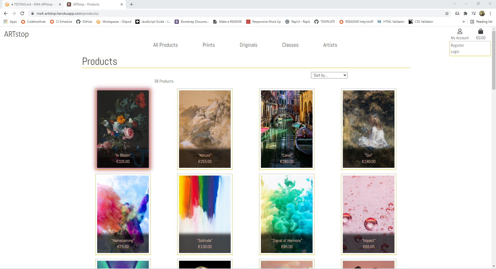
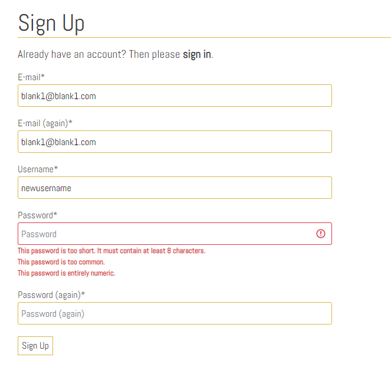

# Full Testing
## Contents
+ [Validator Testing](#validator-testing)
+ [Lighthouse Testing](#lighthouse-testing)
+ [PowerMapper Compatibility](#powermapper-compatibility)
+ [Testing From User Stories](#testing-from-user-stories)
+ [Automated Testing](#automated-testing)
+ [Manually Testing Functionality](#manually-testing-functionality)
+ [Responsive Testing](#responsive-testing)
+ [Bugs and Fixes](#bugs-and-fixes)
+ [Known Bugs](#known-bugs)
---
---
## Validator Testing
### **HTML**

 I checked all of the HTML pages using [W3C Markup Validation Service](https://validator.w3.org/)

 All pages passed all checks. 

### **CSS**

### **JavaScript**

I checked the script.js file using [JSHint](https://jshint.com/)

### **Python**
I checked the app.py file using [PEP8 online](http://pep8online.com/)

The code passed all checks.

---
---
## Lighthouse Testing

### **Performance**

### **Accessibility**

### **Best Practices**

### **SEO**

---
---
## PowerMapper Compatibility

I used [PowerMapper](https://www.powermapper.com/) to test cross-browser compatbility on other browsers that I don't have access to.

---
---
## Testing From User Stories

### As an unregistered, I want to 

  + *be able to browse through all products available.*

All users, regardless of registered/logged in status, can browse through all products, add to bag and make a purchase:



---

  + *have the ability browse through the artists promoted on the site.*

All users, regardless of registered/logged in status, can browse through the promoted artists:


---

  + *have the ability to contact the artists promoted on the site.*

All users, regardless of registered/logged in status, can contact the promoted artist IF they have given contact information:


---

  + *have the ability browse through the classes available on the site.*

All users, regardless of registered/logged in status, can browse through the classes offered on the site:


However, class videos cannot be played without user authentication:


---

  + *have generic questions answered without having to contact the store owner/admin.*

All users, regardless of registered/logged in status, can view the FAQ's page:


---

  + *be able to view my bag and any items I currently have awaiting payment in my bag.*


---

  + *be able to add, edit quantity and remove items from my bag.*

All users, regardless of registered/logged in status, can make changes to their shopping bag:


---

  + *be able to purchase from the site without having to register for an account.*

All users, regardless of registered/logged in status, can purchase from the store. Unregistered/unauthenticated users will be directed to the below page to either choose to sign up/sign in, or they can continue as guest:


---

  + *recieve email confirmation on any orsers that I placed.*

Once a customer has placed an order and they are redirected to the confirmation page, they receive an email with their order and delivery information:


---

  + *have the ability to register to the site if I choose to.*

As well as the page above, a user can go to the register page from the nav bar or page footer:


---

### As a registered user, I want to

  + *have the ability to log in to the site with my details.*

A registered user can log in via the login page. This can be accessed from the nav bar, footer and various stages throughout purchase process/site browsing:


---

  + *have a record of any purchases that I have made in the past and view them in detail.*

From a registered users profile page, previous order details can be accessed:


This will be a replica of the order confirmation page but with a few adjustments to the text & toast to confirm to the user that this is past order:


---

  + *be able to update my shipping information.*

From a registered users profile page, default information can be added/updated:


---

  + *be able to update my shipping information from the checkout page.*

If a registered & logged in user has default delivery information saved in their profile, the checkout form will auto populate with this information. However, this can be overridden when a purchase is being made:

Also, if the user wants to add the new delivery information to their account, they can use the checkout form checkbox. When the purchase is complete, the information will be saved.


---

  + *be able to view the class videos offered.*


---

### As the site administrator, I want to

---

  + *be able to log in to an admin panel.*


  + *be able to add, update or remove products, artists and classes without visiting the admin panel.*
 From the nav bar, the admin will have the option to add products, artists and classes:


These options will open the follwing forms:


Once the items have been uploaded, the admin will be able to edit/delete from the item detail page:


The edit button will open a form that is a replica of the add form but with the previous information poulating the fields. 
<br>
To ensure that an item isn't deleted by mistake, a confirmation has been added to each item:


---

  + *receive email notifications when a user submits through the contact page.*

When a message is sent via the contact form, an email is sent to the admins designated email:


*I set up a specific email account for this prject to keep it seperate from my personal email account*

---
---

## Automated Testing

Automated Unit Testing was carried out with Djangos testing tools and written to cover as much of the site as possible. Below is an overview of each app and what was tested.

### Artists App

+ Models
   + test that name is returned as string

+ Views
   + test that the all artists view works
   + test that the artist detail view works
   + test that the artist detail view works
   + test that the add_artist view ony works for admins
   + test that the edit_artist view ony works for admins
   + test that the admin can edit an artist
   + test that only the admin can delete an artist

+ Forms
   + test that specific fields are required
   + test that an error message appears if form is incorrect


### Bag App

+ Models
   + test the bag url exists
   + test item can be added to bag


### Checkout App

+ Models
   + test that order number is returned as string

+ Views
   + test that the signin_guest view only viewable for unauthenticated users
   + test that the checkout page url exists
   + test that the user gets an error message if they try to access the checkout with an empty bag

+ Forms
   + test that specific fields are required
   + test that correct fields are being displayed to the user on the form


### Classes App

+ Models
   + test that level name is returned as string
   + test that level friendly name is returned
   + test that class name is returned as string

+ Views
   + test that the all artists view works
   + test that the artist detail view works
   + test that the artist detail view works
   + test that the add_artist view ony works for admins
   + test that the edit_artist view ony works for admins
   + test that the admin can edit an artist
   + test that only the admin can delete an artist

+ Forms
   + test that specific fields are required
   + test that an error message appears if form is incorrect


### Contact App

+ Models
   + test that name is returned as string

+ Views
   + test home url

+ Forms
   + test that all fields are required
   + test that an error message appears if form is incorrect


### FAQ's App

+ Views
   + test home url


### Home App

+ Views
   + test home url


### Products App

+ Models
   + test that category name is returned as string

+ Views
   + test that the all products view works
   + test that the product detail view works
   + test that the product detail view works
   + test that the add_product view ony works for admins
   + test that the edit_product view ony works for admins
   + test that the admin can edit a product
   + test that only the admin can delete a product

+ Forms
   + test that specific fields are required
   + test that an error message appears if form is incorrect


### Profiles App

+ Views
   + test that user can access profile page if logged in
   + test that unauthenticated user gets redirected when trying to access the profile page
   + test that user can update default delivery information
   + test that user can view order history

+ Forms
   + test that no form fields are required


## Manually Testing Functionality
### **Navigation**

|Element               |Action|Expected Result               |Pass/Fail|
|:-------------         |:----|:----------------------------------|:---|
| **NavBar**            |                                         |    |
|Site Name (logo area)  |Click|Redirect to home                   |Pass|
|My profile Dropdown    |Click|Open profile dropdown              |Pass|
|Register Link          |Click|Redirect to register page          |Pass|
|                       |     |(Not visible if user in session)   |Pass|
|Log In Link            |Click|Redirect to log in page            |Pass|
|                       |     |(Not visible if user in session)   |Pass|
|Product Management Link|Click|Redirect to add_product page       |Pass|
|                       |     |(Only visble if admin in session)  |Pass|
|Artist Management Link |Click|Redirect to add_artist page        |Pass|
|                       |     |(Only visble if admin in session)  |Pass|
|Class Management Link  |Click|Redirect to add_class  page        |Pass|
|                       |     |(Only visble if admin in session)  |Pass|
|My Profile Link        |Click|Redirect to user profile page      |Pass|
|                       |     |(Only visble if user in session)   |Pass|
|Logout Link            |Click|Redirect to logout confirm  page   |Pass|
|                       |     |(Only visble if user in session)   |Pass|
|Bag Link               |Click|Redirect to bag page               |Pass|
| **SideNav**           |     |                                   |    |
|Hamburger Icon         |Click|Open Sidenav                       |Pass|
|Site Name (logo area)  |Click|Redirect to home                   |Pass|
|My profile Dropdown    |Click|Open profile dropdown              |Pass|
|Register Link          |Click|Redirect to register page          |Pass|
|                       |     |(Not visible if user in session)   |Pass|
|Log In Link            |Click|Redirect to log in page            |Pass|
|                       |     |(Not visible if user in session)   |Pass|
|Product Management Link|Click|Redirect to add_product page       |Pass|
|                       |     |(Only visble if admin in session)  |Pass|
|Artist Management Link |Click|Redirect to add_artist page        |Pass|
|                       |     |(Only visble if admin in session)  |Pass|
|Class Management Link  |Click|Redirect to add_class  page        |Pass|
|                       |     |(Only visble if admin in session)  |Pass|
|My Profile Link        |Click|Redirect to user profile page      |Pass|
|                       |     |(Only visble if user in session)   |Pass|
|Logout Link            |Click|Redirect to logout confirm  page   |Pass|
|                       |     |(Only visble if user in session)   |Pass|
|Bag Link               |Click|Redirect to bag page               |Pass|
| **MainNav**           |     |                                   |    |
|All Products Link      |Click|Redirect all products page         |Pass|
|Prints Dropdown        |Click|Open prints Dropdown               |Pass|
|Phographs Link         |Click|Redirect to prints page filtered to photographs |Pass|
|Art Prints Link        |Click|Redirect to prints page filtered to art prints  |Pass|
|Digital Art Link       |Click|Redirect to prints page filtered to digital art |Pass|
|All Prints Link        |Click|Redirect to prints page            |Pass|
|Originals Dropdown     |Click|Open originals page                |Pass|
|Watercolour Paintings Link|Click|Redirect to originals page filtered to watercolours |Pass|
|Acrylic Paintings Link |Click|Redirect to originals page filtered to acrylics        |Pass|
|Oil Paintings Link     |Click|Redirect to originals page filtered to oil paintings   |Pass|
|Mixed Media Link       |Click|Redirect to originals page filtered to mixed medias    |Pass|
|All Originals Link     |Click|Redirect to originals page         |Pass|
|Classes Dropdown       |Click|Open classes Dropdown              |Pass|
|Beginner Link          |Click|Redirect to classes page filtered to beginner classes     |Pass|
|Intermediate Link      |Click|Redirect to classes page filtered to intermediate classes |Pass|
|Advanced Link          |Click|Redirect to classes page filtered to advanced classes     |Pass|
|All Classes Link       |Click|Redirect to classes page           |Pass|
|Artists Link           |Click|Redirect to artists page           |Pass|
| **Footer**                |     |                          |    |
|*Customer Care*            |     |                          |    |
|Contact Us Link            |Click|Redirect to contact page  |Pass|
|FAQ's Link                 |Click|Redirect to FAQ's page    |Pass|
|Shipping & Handling Link   |Click|Redirect to FAQ's page    |Pass|
|Returns & Exchanges Link   |Click|Redirect to FAQ's page    |Pass|
|*Socials*                  |     |                          |    |
|Facebook Link              |Click|Open on external page     |Pass|
|Instagram Link             |Click|Open on external page     |Pass|
|Twitter Link               |Click|Open on external page     |Pass|
|TikTok Link                |Click|Open on external page     |Pass|
|*Account*                  |     |                          |    |
|**if user not in session** |     |                          |    |
|Log in Link                |Click|Redirect to login page    |Pass|
|Register Link              |Click|Redirect to signup page   |Pass|
|**if user in session**     |     |                          |    |
|profile Link               |Click|Redirect to profile page  |Pass|
|Log out Link               |Click|Redirect to log out confirmation page|Pass|
|**if admin in session**    |Click|Open on external page     |Pass|
|Product Management Link    |Click|Redirect to add product page|Pass|

---
### **Home Page**
| Element               | Action | Expected Result   | Pass/Fail|
|:-------------         |:-----|:-----                     |:---|
|Hero 'Shop Now' Button |Click |Redirect to products page  |Pass|

---

### **Products Page**

| Element                   | Action | Expected Result         | Pass/Fail |
|:-------------             |:-------|:-----                        |:-----|
|'Sort By' Dropdown         |Click   |Open 'sort by' options          |Pass|
|'Sort By' Options (x6)     |Click   |Re-order products               |Pass|
|If category selected:      |        |                                |Pass|
|Category button            |Click   |                                |Pass|
|Product Card               |Hover   |Box shadow appears              |Pass|
|                           |Click   |Redirect to product detail page |Pass|

---

### **Product Detail Page**


| Element                   | Action | Expected Result         | Pass/Fail |
|:-------------             |:-------|:-----                        |:-----|
|Qty control buttons        |Click   |Increase/decrease quantity    |Pass|
|Keep Shopping button       |Click   |Redirect to products page     |    |
|Add to bag button          |Click   |Add item to bag               |Pass|
|                           |        |Toast Success appears         |Pass|
|                           |        |Item visible in toast success |Pass|
|**If admin in session:**   |        |                              |    |
|Edit product button        |Click   |Redirect to edit product page |Pass|
|Delete product button      |Click   |Open delete confirmation modal|Pass|
|Modal cancel button        |Click   |Close modal                   |Pass|
|Modal delete button        |Click   |Delete product                |Pass|

---

### **Artists Page**

| Element                   | Action | Expected Result         | Pass/Fail |
|:-------------             |:-------|:-----                        |:-----|
|Artist Card                |Hover   |Box shadow appears              |Pass|
|                           |Click   |Redirect to product detail page |Pass|

---

### **Artist Detail Page**

| Element                   | Action | Expected Result         | Pass/Fail |
|:-------------             |:-------|:-----                        |:-----|
|Social Media links         |Click   |Link to external ink on seperate tab |Pass|
|All Artists button         |Click   |Redirect to artists page      |Pass|
|Shop Now button            |Click   |Redirect to products page     |Pass|
|Gallery Image              |Hover   |Box shadow appears            |Pass|
|                           |Click   |Redirect to product detail page|Pass|
|**If admin in session:**   |        |                              |    |
|Edit artist button         |Click   |Redirect to edit artist page  |Pass|
|Delete artist button       |Click   |Open delete confirmation modal|Pass|
|Modal cancel button        |Click   |Close modal                   |Pass|
|Modal delete button        |Click   |Delete artist                 |Pass|

---

### **Classes Page**

| Element                   | Action | Expected Result         | Pass/Fail |
|:-------------             |:-------|:-----                        |:-----|
|'Sort By' Dropdown         |Click   |Open 'sort by' options          |Pass|
|'Sort By' Options (x4)     |Click   |Re-order classes                |Pass|
|If level selected:         |        |                                |Pass|
|Level button               |Click   |                                |Pass|
|Class  Card                |Hover   |Box shadow appears              |Pass|
|                           |Click   |Redirect to class  detail page  |Pass|

---

### **Class Detail Page**

| Element                   | Action | Expected Result         | Pass/Fail |
|:-------------             |:-------|:-----                        |:-----|
|**If user in session:**    |        |                              |      |
|Video                      |Onload  |Available (if user in session)|Pass|
|*Video Controls*           |Onload  |Unavailable (if user not in session)|Pass|
|Play                       |Click   |Video Plays                   |Pass|
|Pause                      |Click   |Video Pauses                  |Pass|
|Full Screen                |Click   |Video Expands to fullscreen   |Pass|
|Volume Up                  |Click/Slide |Volume increases          |Pass|
|Volume Down                |Click/Slide |Volume decreases          |Pass|
|Volume Mute                |Click   |Video mutes                   |Pass|
|**If user not in session:**|        |                              |    |
|Video                      |Onload  |Unavailable                   |Pass|
|Login button               |Click   |Video Plays                   |Pass|
|Register button            |Click   |Video Pauses                  |Pass|
|**All users:**             |        |                              |    |
|All Classes button         |Click   |Redirect to classes page      |    |
|**If admin in session:**   |        |                              |    |
|Edit class button          |Click   |Redirect to edit class page   |Pass|
|Delete class button        |Click   |Open delete confirmation modal|Pass|
|Modal cancel button        |Click   |Close modal                   |Pass|
|Modal delete button        |Click   |Delete Class                  |Pass|

---

### **Add Product Page**

| Element                       | Action    | Expected Result                | Pass/Fail |
|:-------------                 |:----------|:-----                          |:-----|
|Form Dropdowns(x2)             |Click      |Show dropdown options           |Pass  |
|Form Text Input (if required)  |Leave blank|On Submit: Warning appears, form won't submit |Pass  |
|Form Text Input (if required)  |Fill In    |On Submit: Form submit          |Pass  |
|Form Text Input         |Just input whitespace|On Submit: Form won't submit |Pass  |
|                               | |On Submit: error message on invalid field |Pass  |
|                               |           |On Submit: error toast appears  |Pass  |
|Form Number field              |Click up/down|increase/decrease value       |Pass  |
|                               |Type into  |Correcct format:Accept value    |Pass  |
|                               |Type into  |Incorrect format:Accept value   |Pass  |
|Form image select button       |Click      |Open device storage             |Pass  |
|                               |           |Chosen image name displayed     |Pass  |
|Cancel button                  |Click      |Redirect to products page       |Pass  |
|Add Product button(form valid) |Click      |Form submit                     |Pass  |
|                               |           |Redirect to product detail page |Pass  |
|                               |           |Product uploaded toast appears  |Pass  |
|Add Product button(form invalid)|Click     |Form doesn't submit             |Pass  |
|                               |           |Error messages on invalid fields|Pass  |

---

### **Edit Product Page**

| Element                       | Action    | Expected Result                | Pass/Fail |
|:-------------                 |:----------|:-----                          |:-----|
|All form fields                |On load    |Populated with original values  |Pass  |
|Form Dropdowns(x2)             |Click      |Show dropdown options           |Pass  |
|Form Text Input (if required)  |Leave blank|On Submit: Warning appears, form won't submit |Pass  |
|Form Text Input (if required)  |Fill In    |On Submit: Form submit          |Pass  |
|Form Text Input                |Just input whitespace|On Submit: Form won't submit|Pass  |
|                               |           |On Submit: error message on invalid field |Pass  |
|                               |           |On Submit: error toast appears  |Pass  |
|Form Number field              |Click up/down|increase/decrease value       |Pass  |
|                               |Type into  |Correct format:Accept value     |Pass  |
|                               |Type into  |Incorrect format:Accept value   |Pass  |
|Form image Select button       |Click      |Open device storage             |Pass  |
|                               |           |New image name displayed        |Pass  |
|Cancel button                  |Click      |Redirect to products page       |Pass  |
|Update Product button(form valid)|Click    |Form submit                     |Pass  |
|                               |           |Redirect to product detail page |Pass  |
|                               |           |Product updated toast appears   |Pass  |
|Update Product button(form invalid)|Click  |Form doesn't submit             |Pass  |
|                               |           |Error messages on invalid fields|Pass  |

---

### **Add Artist Page**

| Element                       | Action    | Expected Result                | Pass/Fail |
|:-------------                 |:----------|:-----                          |:-----|
|Form Text Input (if required)  |Leave blank|On Submit: Warning appears, form won't submit |Pass  |
|Form Text Input (if required)  |Fill In    |On Submit: Form submit          |Pass  |
|Form Text Input         |Just input whitespace|On Submit: Form won't submit |Pass  |
|                               | |On Submit: error message on invalid field |Pass  |
|                               |           |On Submit: error toast appears  |Pass  |
|Form image select button       |Click      |Open device storage             |Pass  |
|                               |           |Chosen image name displayed     |Pass  |
|URL fields                     |Fill In<br>(incorrect format)|On submit:form won't submit|Pass  |
|                               |           |Error message on invalid field  |Pass  |
|                               |Fill In<br>(correct format)|Form submit     |Pass  |
|Cancel button                  |Click      |Redirect to artists page        |Pass  |
|Add Artist button(form valid)  |Click      |Form submit                     |Pass  |
|                               |           |Redirect to artist  detail page |Pass  |
|                               |           |Artist uploaded toast appears   |Pass  |
|Add Artist button(form invalid)|Click      |Form doesn't submit             |Pass  |
|                               |           |Error messages on invalid fields|Pass  |

---

### **Edit Artist Page**

| Element                       | Action    | Expected Result                | Pass/Fail |
|:-------------                 |:----------|:-----                          |:-----|
|All form fields                |On load    |Populated with original values  |Pass  |
|Form Text Input (if required)  |Leave blank|On Submit: Warning appears, form won't submit |Pass  |
|Form Text Input (if required)  |Fill In    |On Submit: Form submit          |Pass  |
|Form Text Input         |Just input whitespace|On Submit: Form won't submit |Pass  |
|                               | |On Submit: error message on invalid field |Pass  |
|                               |           |On Submit: error toast appears  |Pass  |
|Form image select button       |Click      |Open device storage             |Pass  |
|                               |           |New image name displayed        |Pass  |
|URL fields                     |Fill In<br>(incorrect format)|On submit:form won't submit|Pass  |
|                               |           |Error message on invalid field  |Pass  |
|                               |Fill In<br>(correct format)|Form submit     |Pass  |
|Cancel button                  |Click      |Redirect to artists page        |Pass  |
|Update Artist button(form valid)|Click     |Form submit                     |Pass  |
|                               |           |Redirect to artist  detail page |Pass  |
|                               |           |Artist updated toast appears    |Pass  |
|Update Artist button(form invalid)|Click   |Form doesn't submit             |Pass  |
|                               |           |Error messages on invalid fields|Pass  |

---

### **Add Class Page**

| Element                       | Action    | Expected Result                | Pass/Fail |
|:-------------                 |:----------|:-----                          |:-----|
|All form fields                |On load    |Populated with original values  |Pass  |
|Form Dropdown                  |Click      |Show dropdown options           |Pass  |
|Form Text Input (if required)  |Leave blank|On Submit: Warning appears, form won't submit |Pass  |
|Form Text Input (if required)  |Fill In    |On Submit: Form submit          |Pass  |
|Form Text Input         |Just input whitespace|On Submit: Form won't submit |Pass  |
|                               | |On Submit: error message on invalid field |Pass  |
|Form Time Input         |Fill in<br>(Incorrect format)|On Submit: Form won't submit |Pass  |
|                               |           |Error message on invalid field  |Pass  |
|                        |Fill in<br>(Correct format)|On Submit: Form submit |Pass  |
|                               |           |On Submit: error toast appears  |Pass  |
|Form image select button       |Click      |Open device storage             |Pass  |
|Form video select button       |Click      |Open device storage             |Pass  |
|                               |           |Chosen file name displayed      |Pass  |
|Form video upload   |On submit<br>(incorrect file format)|Form won't submit |Pass  |
|                               |           |Error message on invalid field  |Pass  |
|                               |           |Error toast appears             |Pass  |
|                    |On submit<br>(Correct file format) |Form submit        |Pass  |
|URL fields                     |Fill In<br>(incorrect format)|On submit:form won't submit|Pass  |
|                               |           |Error message on invalid field  |Pass  |
|                               |Fill In<br>(correct format)|Form submit     |Pass  |
|Cancel button                  |Click      |Redirect to classes page        |Pass  |
|Add Class button(form valid)   |Click      |Form submit                     |Pass  |
|                               |           |Redirect to class  detail page  |Pass  |
|                               |           |Class uploaded toast appears    |Pass  |
|Add Class button(form invalid) |Click      |Form doesn't submit             |Pass  |
|                               |           |Error messages on invalid fields|Pass  |

---

### **Edit Class Page**

| Element                       | Action    | Expected Result                | Pass/Fail |
|:-------------                 |:----------|:-----                          |:-----|
|Form Dropdown                  |Click      |Show dropdown options           |Pass  |
|Form Text Input (if required)  |Leave blank|On Submit: Warning appears, form won't submit |Pass  |
|                               |Fill In    |On Submit: Form submit          |Pass  |
|Form Text Input         |Just input whitespace|On Submit: Form won't submit |Pass  |
|                               | |On Submit: error message on invalid field |Pass  |
|Form Time Input         |Fill in<br>(Incorrect format)|On Submit: Form won't submit |Pass  |
|                               |           |Error message on invalid field  |Pass  |
|                        |Fill in<br>(Correct format)|On Submit: Form submit |Pass  |
|                               |           |On Submit: error toast appears  |Pass  |
|Form image select button       |Click      |Open device storage             |Pass  |
|                               |           |New image name displayed        |Pass  |
|Form video select button       |Click      |Open device storage             |Pass  |
|                               |           |New file name displayed         |Pass  |
|Form video upload   |On submit<br>(incorrect file format)|Form won't submit |Pass  |
|                               |           |Error message on invalid field  |Pass  |
|                               |           |Error toast appears             |Pass  |
|                    |On submit<br>(Correct file format) |Form submit        |Pass  |
|URL fields                     |Fill In<br>(incorrect format)|On submit:form won't submit|Pass  |
|                               |           |Error message on invalid field  |Pass  |
|                               |Fill In<br>(correct format)|Form submit     |Pass  |
|Cancel button                  |Click      |Redirect to classes page        |Pass  |
|Update Class button(form valid)|Click      |Form submit                     |Pass  |
|                               |           |Redirect to class detail page   |Pass  |
|                               |           |Class updated toast appears     |Pass  |
|Update Class button(form invalid)|Click    |Form doesn't submit             |Pass  |
|                               |           |Error messages on invalid fields|Pass  |

---

### **Bag Page**

| Element                   | Action | Expected Result               | Pass/Fail |
|:-------------             |:-------|:-----                              |:-----|
|**No Bag Items**           |        |                                    |      |
|Shop button                |Click   |Redirect to products page           |Pass  |
|**Bag Items**              |        |                                    |      |
|Qty control buttons        |Click   |Increase/decrease quantity          |Pass  |
|Update button              |Click   |Update bag item quantity            |Pass  |
|                           |        |Updated confirmation toast appears  |Pass  |
|Remove button              |Click   |Remove item from bag                |Pass  |
|                           |        |Removed confirmation toast appears  |Pass  |
|Continue shopping button   |Click   |Redirect to products page           |Pass  |
|Checkout button     |Click<br>(user logged in)|Redirect to checkout page |Pass  |
|       |Click<br>(user not logged in)|Redirect to continue as guest page |Pass  |

---

### **Continue as Guest Page**

| Element                   | Action | Expected Result              | Pass/Fail |
|:-------------             |:-------|:-----                             |:-----|
|Page access      |On load<br>(user logged in)|Redirect to checkout page |Pass  |
|Page access          |On load<br>(user logged in)|Page accessible       |Pass  |
|Sign In button             |Click   |Redirect to log in page            |Pass  |
|Register button            |Click   |Redirect to sign up page           |Pass  |
|Continue as guest button   |Click   |Redirect to checkout page          |Pass  |

---

### **Checkout Page**

| Element                   | Action           | Expected Result                      | Pass/Fail |
|:-------------             |:-----------------|:-----                                     |:-----|
|Page accessible            |Direct URL input<br>(empty bag)|redirect to products page     |Pass  |
|                           |                  |empty bag toast appears                    |Pass  |
|Form fields(if user logged in)|On load |fields populated with user default info(if previously saved)|Pass  |
|Text Input(if required)    |Leave blank       |On submit:form won't submit                |Pass  |
|                           |                  |error message on invalid field(s)          |Pass  |
|                           |Just whitespace   |On submit:form won't submit                |Pass  |
|                           |                  |error message at bottom of page            |Pass  |
|                           |Fill in correctly |On submit: form submits                    |Pass  |
|Phone number Input         |Leave blank       |On submit:form won't submit                |Pass  |
|                           |                  |error message on field                     |Pass  |
|                           |Just whitespace   |On submit:form won't submit                |Pass  |
|                           |                  |error message at bottom of page            |Pass  |
|                   |Use non numeric characters|On submit: form submits   |**Fail**<br>(see known bugs)|
|                           |                  |error on field            |**Fail**<br>(see known bugs)|
|Email Input                |Leave blank       |On submit:form won't submit                |Pass  |
|                           |                  |error message on field                     |Pass  |
|                           |Just whitespace   |On submit:form won't submit                |Pass  |
|                           |                  |error message at bottom of page            |Pass  |
|                           |Fill in correctly |On submit: form submits                    |Pass  |
|Form Dropdown              |Click             |Show dropdown options                      |Pass  |
|Save to profile checkbox   |On load(user logged in)|Shown                                 |Pass  |
|                           |On load(user not logged in)|Not shown                         |Pass  |
|                           |Checked |On submit:Delivery information saved to user profile |Pass  |
|                     |Unchecked |On submit:Delivery information not saved to user profile |Pass  |
|Payment card input         |Input invalid card number|Error message on field              |Pass  |
|                           |Input invalid card date|Error message on field                |Pass  |
|                           |On load(user not logged in)|Not shown                         |Pass  |
|Adjust Bag button          |Click             |Redirect to bag page                       |Pass  |
|Complete Order button(form invalid)|Click     |Form won't submit                          |Pass  |
|                           |                  |Error message on invalid fields            |Pass  |
|Complete Order button(form valid)|Click       |                                           |      |
|                           |Payment succeeds  |loading screen reappears                   |Pass  |
|                           |                  |form submits                               |Pass  |
|                           |                  |redirect to order confirmation page        |Pass  |
|                           |(if user logged in)|order saved to user profile               |Pass  |
|                           |Payment failed    |Loading animation appears                  |Pass  |
|                           |                  |form won't submit                          |Pass  |
|                           |                  |error message at bottom of form            |Pass  |
|              |Payment Requires authentication|Loading animation appears                  |Pass  |
|                           |                  |Authentication box appears                 |Pass  |
|Fail Authentication button |Click             |Authentication box closes                  |Pass  |
|                           |                  |User directed back to form                 |Pass  |
|                           |                  |error message at bottom of form            |Pass  |
|Complete Authentication button|Click          |loading screen reappears                   |Pass  |
|                           |                  |form submits                               |Pass  |
|                           |                  |redirect to order confirmation page        |Pass  |
|                           |(if user logged in)|order saved to user profile               |Pass  |

---

### **Checkout Success Page**

| Element                   | Action | Expected Result         | Pass/Fail |
|:-------------             |:-------|:-----                        |:-----|
|Shop Again! button         |Click   |Redirect to products page       |Pass|
|View Classes button        |Click   |Redirect to classes page        |Pass|
|Browse Artists button      |Click   |Redirect to artists page        |Pass|

---

### **Profile Page**

| Element                   | Action           | Expected Result                      | Pass/Fail |
|:-------------             |:-----------------|:------------------------------------------|:-----|
|Form fields         |On load |fields populated with user default info(if previously saved)|Pass  |
|All input fields           |Leave blank       |On submit: form submits                    |Pass  |
|                           |Just whitespace   |On submit: form submits                    |Pass  |
|                           |Fill in correctly |On submit: form submits                    |Pass  |
|Form Dropdown              |Click             |Show dropdown options                      |Pass  |
|Update button              |Click             |Form submits                               |Pass  |
|                           |                  |Form updated toast appears                 |Pass  |
|Previous order number      |Click             |Redirect to previous order page            |Pass  |
* *none of the form fields are required and don't have the same level of validation as the checkout form*
* *If a user uses incorrect profile information on the checkout page, it will be validatied there*

---

### **Previous Order Page**

| Element                   | Action | Expected Result         | Pass/Fail |
|:-------------             |:-------|:-----                        |:-----|
|Toast                  |On load |Previous order info toast appears |      |
|Back to Profile button     |Click   |Redirect to profile page      |Pass  |

---

### **FAQ's Page**

| Element                   | Action | Expected Result         | Pass/Fail |
|:-------------             |:-------|:-----                        |:-----|
|Dropdown #3.Sign up link   |Click<br>(user logged in)|Redirect to home page |Pass  |
|           |Click<br>(user not logged in)|Redirect to sign up page |Pass  |
|Dropdown #11.Contact link  |Click   |Redirect to contact page      |Pass  |
|Page bottom contact link   |Click   |Redirect to contact page      |Pass  |

---

### **Contact Page**

| Element                   | Action | Expected Result         | Pass/Fail |
|:-------------             |:-------|:-----                        |:-----|
|Text Input                 |Leave blank       |On submit:form won't submit                |Pass  |
|                           |                  |error message on invalid field(s)          |Pass  |
|                           |Just whitespace   |On submit:form won't submit              |**FAIL**|
|                           |                  |error message on field(s)                |**FAIL**|
|                           |Fill in correctly |On submit: form submits                    |Pass  |
|Email Input                |Leave blank       |On submit:form won't submit                |Pass  |
|                           |                  |error message on field                     |Pass  |
|                           |Just whitespace   |On submit:form won't submit                |Pass  |
|                           |                  |error message at bottom of page            |Pass  |
|                           |Wrong format      |On submit:form won't submit                |Pass  |
|                           |                  |error message on field                     |Pass  |
|                           |Fill in correctly |On submit: form submits                    |Pass  |
|Form Dropdown              |Click             |Show dropdown options                      |Pass  |
|Send button(form invalid)  |Click             |Form won't submit                          |Pass  |
|                           |                  |error message on invalid field(s)          |Pass  |
|Send button(form valid)    |Click             |Form submits                               |Pass  |
|                           |                  |Mail sent toast appears                    |Pass  |
|                           |                  |Email notificaiton sent to admin           |Pass  |

---

### **Allauth Pages**

| Element                   | Action | Expected Result                   | Pass/Fail |
|:-------------             |:-------|:---------------------------------------|:-----|
|**Register**               |        |                                        |      |
|Sign in link               |Click   |Redirect to sign in page                |Pass  |
|*Form*                     |        |                                        |      |
|Email field        |Fill in<br>(incorrect format)|On submit: form wont'submit|Pass  |
|                           |        |Error message on invalid field          |Pass  |
|                          |Fill in<br>(correct format)|On submit: form submit|Pass  |
|                 |Fill in<br>(email already used)|On submit: form wont'submit|Pass  |
|                           |        |Error message on invalid field          |Pass  |
|                  |Fill in<br>(email not already used)|On submit: form submit|Pass  |
|Username field       |Fill in<br>(all whitespace)|On submit: form wont'submit|Pass  |
|                           |        |Error message on invalid field          |Pass  |
|                          |Fill in<br>(correct format)|On submit: form submit|Pass  |
|              |Fill in<br>(username already used)|On submit: form wont'submit|Pass  |
|                           |        |Error message on invalid field          |Pass  |
|               |Fill in<br>(username not already used)|On submit: form submit|Pass  |
|Password field         |Fill in<br>(incorrect format)|On submit: form wont'submit|Pass  |
|                       |            |error message on invalid field          |Pass  |
|                     |Fill in<br>(correct format)|On submit: form wont'submit|Pass  |
|              |Fill in<br>(passwords don't match)|On submit: form wont'submit|Pass  |
|                           |        |error message on invalid field          |Pass  |
|                         |Fill in<br>(passwords match)|On submit: form submit|Pass  |
|Sign Up button(form invalid)|Click  |Form wont'submit                        |Pass  |
|                           |        |error message on invalid fields         |Pass  |
|Sign Up button(form valid) |Click   |Form submit                             |Pass  |
|                           |        |redirect to email verification page     |Pass  |
|                           |        |email sent to user                      |Pass  |
|**Email Verification**     |        |                                        |      |
|Follow link from email     |Click   |redirect to confirm email page          |Pass  |
|Confirm button             |Click   |redirect to log in page                 |Pass  |
|                           |        |sign in form populated with user info   |Pass  |
|                           |        |email confirmation toast appears        |Pass  |
|**Login**                  |        |                                        |      |
|Sign up link               |Click   |Redirect to sign up page                |Pass  |
|*Form*                     |        |                                        |      |
|Username Field     |Fill in<br>(just whitespace)|On submit:form won't submit |Pass  |
|                           |        |error message on invalid field          |Pass  |
|                    |Fill in<br>(wrong username)|On submit:form won't submit |Pass  |
|                           |        |error message for username/password     |Pass  |
|Password Field     |Fill in<br>(just whitespace)|On submit:form won't submit |Pass  |
|                           |        |error message on invalid field          |Pass  |
|                    |Fill in<br>(wrong password)|On submit:form won't submit |Pass  |
|                           |        |error message for username/password     |Pass  |
|Forgot Password button     |Click   |redirect to password reset page         |Pass  |
|Sign In button(form invalid)|Click  |form won't submit                       |Pass  |
|                           |        |error message on invalid field(s)       |Pass  |
|Sign In button(form valid) |Click   |form submit                             |Pass  |
|                           |        |redirect to home page                   |Pass  |
|                           |        |sign in confirmation toast appears      |Pass  |
|**Password Reset**         |        |                                        |      |
|Email Field        |Fill in<br>(just whitespace)|On submit:form won't submit |Pass  |
|                           |        |error message on invalid field          |Pass  |
|                |Fill in<br>(incorrect email)|On submit:form won't submit    |Pass  |
|                           |        |error message on invalid field          |Pass  |
|                           |Fill in<br>(correct email)|On submit:form submit |Pass  |
|Forgot Password button     |Click   |redirect to password reset page         |Pass  |
|Reset password button(form invalid)|Click  |form won't submit                |Pass  |
|                           |        |error message on invalid field          |Pass  |
|Reset password button(form valid)|Click  |form submit                        |Pass  |
|                           |        |redirect to password reset confirmation |Pass  |
|                           |        |email sent to user                      |Pass  |
|**Change Password**        |        |                                        |      |
|Password reset link from email|Click|redirect to change password page        |Pass  |
|Password input     |Fill in<br>(all whitespace)|On submit: form won't submit |Pass  |
|                           |        |error message on field                  |Pass  |
|           |Fill in<br>(passwords not matching)|On submit: form won't submit |Pass  |
|                           |        |error message on field                  |Pass  |
|                        |Fill in<br>(passwords match)|On submit: form submit |Pass  |
|Change password button(form invalid)|Click|Redirect to change password confirmation|Pass  |
|                           |      |Password change confirmation toast appears|Pass  |
|**Logout Confirmation**    |        |                                        |      |
|Sign out button            |Click   |Redirect to homepage                    |Pass  |
|                           |        |Sign out confirmation toast appears     |Pass  |

---
---
## Responsive Testing
Through devices that I have at home/readily available to me, I was able to continuously test on:
### Phone:
+ Samsung Galaxy S9
  + Google Chrome
  + Samsung Internet
+ Huawei Y7
  + Google Chrome
+ iPhone 6
  + Safari
### Tablet
+ iPad Mini 7.9"
  + Safari
+ iPad 9.7"
  + Safari
### Computer
* Avita Pura 14" Laptop
  * Google Chrome
  * Microsoft Edge
  * Opera
  * Mozilla Firefox
### Responsinator
+ When there were devices/browsers that I didn't have access to, I used [Responsinator](https://www.responsinator.com/) to make sure that the site was responsive.

---
---
## Bugs and Fixes

### **Bag Total Issue**

I decided to use a specific delivery charge rather than a percentage of the order total. Because of this, the delivery charge was automatically added to the bag before and item had been added in:


The issue was that the delivery charge was incorperated into the grand total and that was what was being used:


I updated the code so that there would only be a display amount if there were items in the bag:


I also decided to display only the order total at this stage in the purchase process and not the delivery charge.

---

### **Delivery Cost Issue**

When testing out the purchase functionality, I saw that the delivery was charging order_total + the base 15 delivery fee:


I had accidentally added the ```self.order_total``` to the ```settings.STRANDARD_DELIVERY```:


I removed the ```settings.STRANDARD_DELIVERY```:


This fixed the issue

---

### **Artist Detail Image Issue**

When uploading the artist image to the artist detail page, there was an issue when the uploaded picture was in portrait:


This was the code that worked if the uploaded image was in landscape:


I'm sure there were other ways to fix this issue using just CSS but I wanted to practice my JavaScript:


Adding different classes to the images based on the height:width sizes fixed this:


This also adds the landscape class to a perfectly square image and the image layout works.

---

### **Classes Filter Issue**

When I tested the filter for the class levels, no classes were showing on the screen - I had made sure that they had been added to the database:


I had removed the filter options and the classes were showing. When I checked the admin panel for any typos, I noticed that I had only created a ```name``` field and no accompanying ```friendly_name``` field and had capitalised the level name:


To test to see if this was causing the issue, I capitalised the filtername in the HTML template: 


A quick fix would have been to just capitalise all of the filter name on the HTML template but to standardize the code, I added the ```friendly_name``` field to the model:


I then updated the name to be lowercase and making it programatically friendly:


This fixed the issue:


*the card diplay level has since been updated to display the friendly name*

---

### **Side Nav at 992px Issue**

For the home page, I wanted to have the main nav to sit at the bottom of the screen on large screens and up. Form medium screens and down, there's a side nav. But when the screen was exactly 992px the main nav position changed and jumped to the top of the screen:

  + **at 991px**:


  + **at 993px**:


  + **at 992px**:


I had a look and found a discrepency in my code - Bootstrap uses ```@media (min-width: 992px)``` while I had set my media queries to ```@media (man-width: 992px)``` so there was a conflict being created at exactly 992px.

I was far enough into the project that changing my media queries to ```@media (min-width: ***px)``` and having to restyle the pages wouldn't have been the best idea(had it been caught earlier I would have). I decided that making a media query specifically for 992px would be the quickest and safest option:


This is something that I will keep an eye on going forwards.

---

### **Autofocus Issue**

On the signup form, if there was an error on the password field when the form submitted, the autofocus would be on the username field, causing confusion. 


Because the form was generated from allauth it was harder to understand where the issue was coming from or how to fix it. Rather than trying to rework where it was coming from, I used the ```.blur()``` method to remove the autofocus altogether:


Now, regardless of the error, the autofocus doesn't direct the user anywhere specific but the error messages still let the user know wherer they went wrong:



---
---

## Known Bugs

---

### **Checkout Form Whitespace Issue**

If the user inputs information in the wrong format or leaves a required field blank, the form validation doesn't allow the form to be submitted. However, when the user fills in just whitespace, the form is submitting to Stripe, Stripe sends it back and a user-unfriendly error is displayed:


---

### **Stripe Test Webhook Issues**

**not a bug but something that I had to query regardless**

When initally setting up Stripe payments, I was not having any issues with either ```payment_intent.succeeded``` or ```payment_intent.payment_failed``` test webhooks. However, once the full payment system was in place and fully functional, I was having issues with ```payment_intent.succeeded``` test webhook. I would recieve a 500 error both in Stripe and the local terminal:


The 500 error was pointing to the ```bag``` in the webhook_handler.py file. However, the ```bag``` variable was created in the views.py file. I didn't know how to solve this so I contected tutor support and the Full Stack Frameworks slack channel. <br>
The general consensus was that this would be an expected behviour when sending a test ```payment_intent.succeeded``` webhook.<br>
When sending a ```payment_intent.succeeded``` test webhook, Stripe sends default data, but the data held in the ```cache_checkout_data(request)``` would be different, causing the conflict.


To test this theory, I commented out the ```cache_checkout_data(request)``` function and the test webhook worked.


